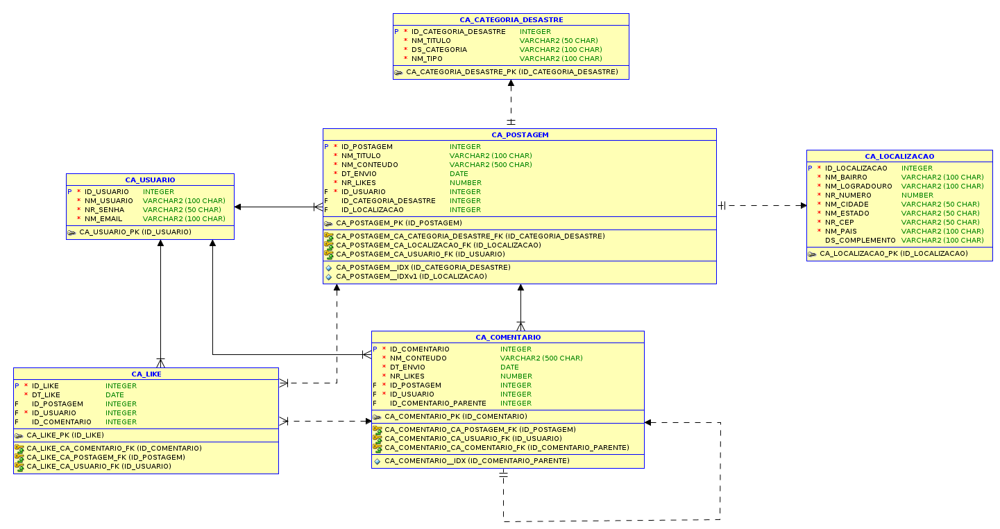
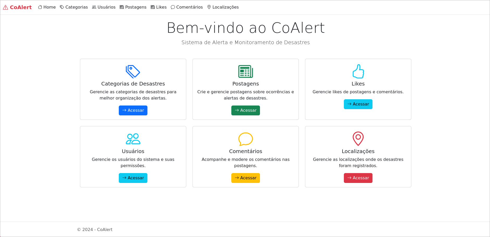
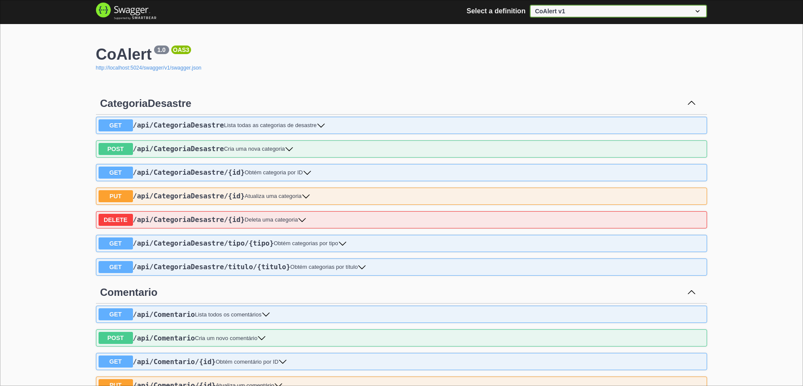

# Co-Alert

---

## Sumário

- [Co-Alert](#co-alert)
  - [Sumário](#sumário)
  - [Descrição do Projeto](#descrição-do-projeto)
  - [Autores](#autores)
    - [Turma 2TDSR - Análise e Desenvolvimento de Sistemas](#turma-2tdsr---análise-e-desenvolvimento-de-sistemas)
  - [Diagrama Database](#diagramas-database)
  - [Dockerfile](#dockerfile)
  - [Instalação do Projeto via Docker](#instalação-do-projeto-via-docker)
    - [Requisitos](#requisitos)
    - [Configuração](#configuração)
  - [Instalação do Projeto via Host](#instalação-do-projeto-via-host)
    - [Requisitos](#requisitos-1)
    - [Configuração](#configuração-1)
    - [Rodar o Projeto Localmente](#rodar-o-projeto-localmente)
      - [Com IDE (Rider ou Visual Studio)](#com-ide-rider-ou-visual-studio)
      - [Sem IDE (usando linha de comando)](#sem-ide-usando-linha-de-comando)
  - [Acesso à API](#acesso-à-api)
  - [Exemplos de Teste da API](#exemplos-de-teste-da-api)
    - [Categoria de Desastre](#categoria-de-desastre)
    - [Localização](#localização)
    - [Usuário](#usuário)
    - [Postagem](#postagem)
    - [Comentário](#comentário)
    - [Like](#like)
  - [Rotas da API](#rotas-da-api)
    - [Categoria de desastre](#categoria-de-desastre-1)
    - [Comentários](#comentários)
    - [Likes](#likes)
    - [Localização](#localização-1)
    - [Postagem](#postagem-1)
    - [Usuário](#usuário-1)

---

## Descrição do Projeto

O Co-Alert surge como uma rede colaborativa de comunicação, que funciona como uma plataforma tipo fórum, permitindo aos usuários compartilhar informações em tempo real sobre desastres naturais e eventos climáticos extremos. Através de publicações detalhadas, que incluem tipo de ocorrência, localização exata e imagens, a comunidade pode acessar informações confiáveis e atualizadas, melhorando a tomada de decisões e a preparação para esses eventos.

Nosso público-alvo é composto por pessoas que vivem em áreas vulneráveis a desastres naturais, indivíduos com acesso limitado a informações oficiais e qualquer pessoa interessada em estar preparada para situações de emergência climática.

Com o Co-Alert, buscamos impactar positivamente a vida dessas pessoas, reduzindo a desinformação e os alarmes falsos, facilitando o fluxo rápido e acessível de dados relevantes, para que possam agir com segurança e antecedência.

Este projeto responde a um desafio crescente: o aumento de até 460% nos desastres climáticos no Brasil desde os anos 1990, comprovando a necessidade de ferramentas eficientes para comunicação e prevenção

Essa integração permite o acompanhamento via aplicativo, promovendo **eficiência, segurança e organização**. O sistema também gerencia cadastro/edição de dados, autenticação/autorizacão, gestão de permissões e dashboards com relatórios para tomada de decisão.

## Autores

### Turma 2TDSR - Análise e Desenvolvimento de Sistemas

* Daniel Saburo Akiyama - RM 558263
* Danilo Correia e Silva - RM 557540
* João Pedro Rodrigues da Costa - RM 558199

## Diagramas Database



*Diagrama para MVP — ainda passível de várias melhorias.*

## Dockerfile

Dockerfile de desenvolvimento sem migração (mais leve):
[Dockerfile Development](./CoAlert/Dockerfile.dev)

Dockerfile de desenvolvimento com migração (mais pesada):
[Dockerfile Development Migration](./CoAlert/Dockerfile.dev-migration)

Imagem Docker Hub: [Imagem Docker Hub com as duas Tags](https://hub.docker.com/repository/docker/danielakiyama/coalert/general)

**Observação**: Em produção, o ideal é usar a imagem aspnet apenas para executar a aplicação, deixando as migrações para serem feitas fora do container ou em um container separado com o SDK. Isso torna a imagem final mais leve e segura. Contudo, optamos por utilizar o SDK na imagem para facilitar o desenvolvimento do projeto.

## Instalação do Projeto via Docker 

### Requisitos
- Docker instalado e com a engine ligada

### Configuração

1. Rode um container utilizando variaveis de ambiente e a imagem no Docker Hub pelo build

Utilize o comando abaixo, substituindo meuusuario e minhasenha com suas credenciais do Oracle DB:

```bash
  # Esse comando só funciona em bash por conta do \
  docker run -d \
  -e ORACLE_USER=seusuario \
  -e ORACLE_PASSWORD=suasenha \
  -e ORACLE_HOST=oracle.fiap.com.br \
  -e ORACLE_PORT=1521 \
  -e ORACLE_SID=ORCL \
  -e RUN_MIGRATIONS=true \
  -p 5024:5024 \
  danielakiyama/coalert:development-migration-v1.0.0
```

Em uma linha só (recomendado):
```bash
  # Funciona no CMD e Bash (recomendado)
  docker run -d -e ORACLE_USER=seusuario -e ORACLE_PASSWORD=suasenha -e ORACLE_HOST=oracle.fiap.com.br -e ORACLE_PORT=1521 -e ORACLE_SID=ORCL -e RUN_MIGRATIONS=true -p 5024:5024 danielakiyama/coalert:development-migration-v1.0.0
```

OU, se não quiser rodar as migrations:

```bash
  # Esse comando só funciona em bash por conta do \
  docker run -d \
  -e ORACLE_USER=seusuario \
  -e ORACLE_PASSWORD=suasenha \
  -e ORACLE_HOST=oracle.fiap.com.br \
  -e ORACLE_PORT=1521 \
  -e ORACLE_SID=ORCL \
  -p 5024:5024 \
  danielakiyama/coalert:development-v1.0.0
```

Em uma linha só (recomendado):
```bash
  # Funciona no CMD e Bash (recomendado)
  docker run -d -e ORACLE_USER=seusuario -e ORACLE_PASSWORD=suasenha -e ORACLE_HOST=oracle.fiap.com.br -e ORACLE_PORT=1521 -e ORACLE_SID=ORCL -p 5024:5024 danielakiyama/coalert:development-v1.0.0
```

Legendas:

```bash
docker run -d \
  -e ORACLE_USER=seusuario           # Usuário do banco Oracle
  -e ORACLE_PASSWORD=suasenha        # Senha do usuário Oracle
  -e ORACLE_HOST=oracle.fiap.com.br  # Host do banco Oracle
  -e ORACLE_PORT=1521                # Porta do banco Oracle (geralmente 1521)
  -e ORACLE_SID=ORCL                 # SID da instância Oracle
  -e RUN_MIGRATIONS=true             # Controla se as migrações serão executadas na inicialização (true/false)
  -p 5169:5169                      # Mapeia a porta 5169 do container para a mesma porta na máquina host
  danielakiyama/mottracker:<tags diferentes>  # Nome da imagem e tag Docker a ser executada, lembrando Development (leve) não roda migrations, Development-Migration (pesada) roda.
```

## Instalação do Projeto via Host

### Requisitos
- .NET SDK 8.0 instalado
- Rider / Visual Studio instalado (opcional)

### Configuração

Clone o projeto utilizando git

1. No arquivo `appsettings.Development.json`, configure e adicione a string de conexão do Oracle DB com seu usuário e senha, por exemplo:

```json
"ConnectionStrings": {
  "Oracle": "Data Source=(DESCRIPTION=(ADDRESS_LIST=(ADDRESS=(PROTOCOL=TCP)(HOST=seuhost)(PORT=suaporta)))(CONNECT_DATA=(SERVER=DEDICATED)(SID=seusid)));User Id=seuusuario;Password=suasenha;"
}
```

Ou crie um arquivo .env no diretório do projeto contendo: 

```bash
  ORACLE_USER=seusuario
  ORACLE_PASSWORD=suasenha
  ORACLE_HOST=seuhost
  ORACLE_PORT=suaporta
  ORACLE_SID=seusid
```

2. Execute as migrations para criar as tabelas no banco Oracle:

   (entre no diretório do projeto primeiro)

```bash
  dotnet ef database update
```

Caso não tenha a ferramenta dotnet-ef instalada, instale com:

```bash
  dotnet tool install --global dotnet-ef
```

### Rodar o Projeto Localmente

Após configurar a string de conexão e aplicar as migrations, você pode rodar a API de duas maneiras:

#### 1. Com IDE (Rider ou Visual Studio)

1. Abra a solução no Rider ou Visual Studio.
2. Selecione o projeto da API como *Startup Project*.
3. Clique em **Run** com o perfil `http`.

#### 2. Sem IDE (usando linha de comando)

1. **Restaurar e compilar:**

- Para rodar o backend, entre no diretório `CoAlert_DotNet` antes de executar o comando.
  
- Caso deseje rodar o backend de dentro do diretório do projeto .net, altere o caminho e remova a flag `--project CoAlert` no comando correspondente.

```bash
dotnet restore CoAlert/CoAlert.csproj
dotnet build
```

4. **Rodar o projeto:**

```bash
dotnet run --project CoAlert --urls "http://localhost:5024"
```

## Acesso à API

- Aplicação Razor: [http://localhost:5024/](http://localhost:5024/)



- Swagger: [http://localhost:5024/swagger](http://localhost:5024/swagger/index.html)



- API: [http://localhost:5024/api](http://localhost:5024/api/)

## Exemplos de Teste da API

### Categoria de Desastre

**Exemplo POST**

```json
{
  "nmTitulo": "Enchente Urbana",
  "dsCategoria": "Desastres relacionados ao acúmulo de água em áreas urbanas devido a chuvas intensas.",
  "nmTipo": "Hidrológico"
}
```

**Exemplo PUT**

```json
{
  "nmTitulo": "Enchente Urbana Moderada",
  "dsCategoria": "Inundações em áreas urbanas causadas por chuvas acima da média, com impactos localizados.",
  "nmTipo": "Hidrológico"
}
```

---

### Localização

**Exemplo POST**

```json
{
  "nmBairro": "Centro",
  "nmLogradouro": "Rua das Flores",
  "nrNumero": 123,
  "nmCidade": "São Paulo",
  "nmEstado": "SP",
  "nrCep": "01001-000",
  "nmPais": "Brasil",
  "dsComplemento": "Apartamento 101"
}
```

**Exemplo PUT**

```json
{
  "nmBairro": "Centro",
  "nmLogradouro": "Rua das Palmeiras",
  "nrNumero": 456,
  "nmCidade": "São Paulo",
  "nmEstado": "SP",
  "nrCep": "01001-001",
  "nmPais": "Brasil",
  "dsComplemento": "Bloco B, Apt. 202"
}
```

---

### Usuário

**Exemplo POST**

```json
{
  "nmUsuario": "joaosilva",
  "nrSenha": "SenhaForte123!",
  "nmEmail": "joao.silva@email.com"
}
```

**Exemplo PUT**

```json
{
  "nmUsuario": "joaosilva_atualizado",
  "nrSenha": "NovaSenhaSegura456!",
  "nmEmail": "joao.silva.novo@email.com"
}
```

---

### Postagem

**Exemplo POST**

```json
{
  "nmTitulo": "Deslizamento em encosta",
  "nmConteudo": "Foi registrado um deslizamento de terra em uma área de risco após fortes chuvas.",
  "usuarioId": COLOQUE_O_ID_DO_USUARIO,
  "categoriaDesastreId": COLOQUE_O_ID_DA_CATEGORIA,
  "localizacaoId": COLOQUE_O_ID_DA_LOCALIZACAO
}
```

**Exemplo PUT**

```json
{
  "nmTitulo": "Deslizamento em encosta atualizado",
  "nmConteudo": "Atualização: o deslizamento afetou três residências e interditou a rua principal.",
  "usuarioId": COLOQUE_O_ID_DO_USUARIO,
  "categoriaDesastreId": COLOQUE_O_ID_DA_CATEGORIA,
  "localizacaoId": COLOQUE_O_ID_DA_LOCALIZACAO
}
```

---

### Comentário

**Exemplo POST**

```json
{
  "nmConteudo": "Excelente relato, obrigado por compartilhar!",
  "usuarioId": COLOQUE_O_ID_DO_USUARIO,
  "postagemId": COLOQUE_O_ID_DA_POSTAGEM
}
```

**Exemplo PUT**

```json
{
  "nmConteudo": "Atualizando meu comentário: a situação foi resolvida pela Defesa Civil.",
  "usuarioId": COLOQUE_O_ID_DO_USUARIO,
  "postagemId": COLOQUE_O_ID_DA_POSTAGEM
}
```

---

### Like

**Exemplo POST**

```json
{
  "usuarioId": COLOQUE_O_ID_DO_USUARIO,
  "postagemId": COLOQUE_O_ID_DA_POSTAGEM
}
```

## Rotas da API

### Categoria de desastre

| Método | Rota                                 | Descrição                             |
| ------ | ------------------------------------ | ------------------------------------- |
| GET    | `/categoria-desastre`                 | Lista todas as categorias de desastre |
| POST   | `/categoria-desastre`                 | Cria uma nova categoria               |
| GET    | `/categoria-desastre/{id}`            | Obtém categoria por ID                |
| PUT    | `/categoria-desastre/{id}`            | Atualiza uma categoria                |
| DELETE | `/categoria-desastre/{id}`            | Deleta uma categoria                  |
| GET    | `/categoria-desastre/tipo/{tipo}`     | Obtém categorias por tipo             |
| GET    | `/categoria-desastre/titulo/{titulo}` | Obtém categorias por título           |

### Comentários

| Método | Rota                                   | Descrição                  |
| ------ | -------------------------------------- | -------------------------- |
| GET    | `/comentario`                          | Lista todos os comentários |
| POST   | `/comentario`                          | Cria um novo comentário    |
| GET    | `/comentario/{id}`                     | Obtém comentário por ID    |
| PUT    | `/comentario/{id}`                     | Atualiza um comentário     |
| DELETE | `/comentario/{id}`                     | Deleta um comentário       |
| GET    | `/comentario/postagem/{postagemId}`    | Comentários por postagem   |
| GET    | `/comentario/usuario/{usuarioId}`      | Comentários por usuário    |
| GET    | `/comentario/respostas/{comentarioId}` | Respostas de um comentário |

### Likes

| Método | Rota                              | Descrição              |
| ------ |-----------------------------------| ---------------------- |
| POST   | `/like/toggle`                    | Alternar curtida       |
| GET    | `/like/postagem/{postagemId}`     | Curtidas da postagem   |
| GET    | `/like/comentario/{comentarioId}` | Curtidas do comentário |
| GET    | `/like/usuario/{usuarioId}`       | Curtidas do usuário    |

### Localização

| Método | Rota                           | Descrição                   |
| ------ | ------------------------------ | --------------------------- |
| GET    | `/localizacao`                 | Lista todas as localizações |
| POST   | `/localizacao`                 | Cria uma nova localização   |
| GET    | `/localizacao/{id}`            | Obtém localização por ID    |
| PUT    | `/localizacao/{id}`            | Atualiza uma localização    |
| DELETE | `/localizacao/{id}`            | Deleta uma localização      |
| GET    | `/localizacao/cidade/{cidade}` | Localizações por cidade     |
| GET    | `/localizacao/estado/{estado}` | Localizações por estado     |
| GET    | `/localizacao/cep/{cep}`       | Localização por CEP         |

### Postagem

| Método | Rota                                         | Descrição                 |
| ------ |----------------------------------------------| ------------------------- |
| GET    | `/postagem`                                  | Lista todas as postagens  |
| POST   | `/postagem`                                  | Cria uma nova postagem    |
| GET    | `/postagem/{id}`                             | Obtém postagem por ID     |
| PUT    | `/postagem/{id}`                             | Atualiza uma postagem     |
| DELETE | `/postagem/{id}`                             | Deleta uma postagem       |
| GET    | `/postagem/usuario/{usuarioId}`              | Postagens por usuário     |
| GET    | `/postagem/categoria-desastre/{categoriaId}` | Postagens por categoria   |
| GET    | `/postagem/localizacao/{localizacaoId}`      | Postagens por localização |

### Usuário

| Método | Rota                  | Descrição               |
| ------ |-----------------------| ----------------------- |
| GET    | `/usuario`            | Lista todos os usuários |
| POST   | `/usuario`            | Cria um novo usuário    |
| GET    | `/usuario/{id}`       | Obtém usuário por ID    |
| PUT    | `/usuario/{id}`       | Atualiza um usuário     |
| DELETE | `/usuario/{id}`       | Deleta um usuário       |
| POST   | `/usuario/autenticar` | Autentica um usuário    |


